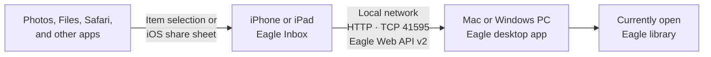

# Eagle Inbox

  

Eagle Inbox is an iOS app for sending photos, files, URLs, and other supported media from your device to [Eagle](https://eagle.cool/) over the same local network.

You can also send items directly from the share sheet in Photos, Files, Safari, and other apps.

## Get Started

### 1. Connect to Eagle

Open the destination library in Eagle. In Eagle Inbox, tap `Connection Required`, choose or add a connection, and enter the computer’s host or IP address and port (usually `41595`). Run `Test Connection`, then save and select the connection. Add the API token from Eagle → Settings → Developer only if required.

| 1. Before setup | 2. Add a connection |
| --- | --- |
|  |  |

| 3. Connection editor | 4. Saved connection |
| --- | --- |
|  |  |

The host, library name, and API token shown are examples.

### 2. Add items

Tap `+` to add photos, files, or a URL. Use Metadata to apply folders, an annotation, and tags to the batch.

| Add items | Set metadata |
| --- | --- |
|  |  |

Open Folders or Tags from Metadata to reuse recent choices, browse available values, and apply them to the entire batch.

| Choose folders | Choose tags |
| --- | --- |
|  |  |

### 3. Send or share

Tap `Send to Eagle` when the queue is ready. You can also open Eagle Inbox from the share sheet in another app.

| Ready to send | Share from another app |
| --- | --- |
|  |  |

Allow local network access when prompted. Notifications are optional and do not affect uploads.

## Features

- Send photos, videos, audio, PDFs, and URLs to Eagle
- Add items from the share sheet
- Save and switch between multiple connections
- Apply folders, an annotation, and tags to an entire batch
- Preview queued items with thumbnails, cancel uploads, and retry failures
- Verify the destination Eagle library before uploading

## Requirements

- Optimized for iPhone with iOS 17 or later
- Available on iPad in iPhone compatibility mode
- Available on Apple Silicon Macs as a Designed for iPhone app
- Eagle 4.0 Build 21 or later

Mac Catalyst and Intel Macs are not supported.

Connect the Mac or Windows PC running Eagle and the device running Eagle Inbox to the same trusted local network.

## Network and Eagle Web API

Eagle Inbox communicates directly with the [Eagle Web API v2](https://developer.eagle.cool/web-api) running in the Eagle desktop app. The connection uses `http://<host>:<port>/api/v2/...` over the local network—currently HTTP, not HTTPS/TLS. The usual port is `41595`, and an API token, when configured, is included in the URL query parameters.

Files and metadata are sent directly from Eagle Inbox to the computer running Eagle. They are not relayed through an Eagle Inbox server.

Because HTTP does not encrypt the API token or uploaded content in transit, use Eagle Inbox only on a trusted private network. Do not expose the Eagle API port to the internet or use it over public Wi-Fi. iOS may ask for Local Network permission before the first connection.

## Library Mismatch

Each connection stores the name of the Eagle library that was open when the connection was tested.

| Mismatch warning | Confirmation before sending |
| --- | --- |
|  |  |

- The main screen displays `Library mismatch.` when another library is open.
- During an upload, you can confirm that you want to use the currently open library for that upload only.
- To change the library stored with a connection, run `Test Connection` in the Connection Editor.

## Privacy and Security

API tokens are stored in Keychain. The app includes no third-party advertising, analytics, or tracking SDKs.

The Eagle Web API connection uses HTTP and sends the API token as a URL query parameter. See [Network and Eagle Web API](#network-and-eagle-web-api) for the communication path and network precautions.

## Developer Documentation

- [Architecture](./Docs/ARCHITECTURE.md)
- [Build, test, and release guide](./Docs/DEVELOPMENT.md)
- [App Store submission draft](./Docs/APP_STORE_SUBMISSION.md)
- [Eagle Web API v2](https://developer.eagle.cool/web-api)
