# Eagle Inbox

  

Eagle Inbox is an iOS app for sending photos, files, URLs, and other supported media from your device to [Eagle](https://eagle.cool/) over the same local network or to an Eagle API-compatible endpoint.

You can also send items directly from the share sheet in Photos, Files, Safari, and other apps, or from Apple Shortcuts and the iPhone Action Button.

  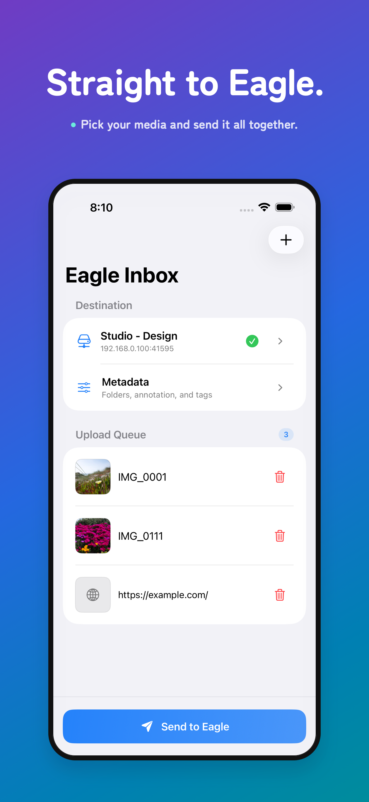
  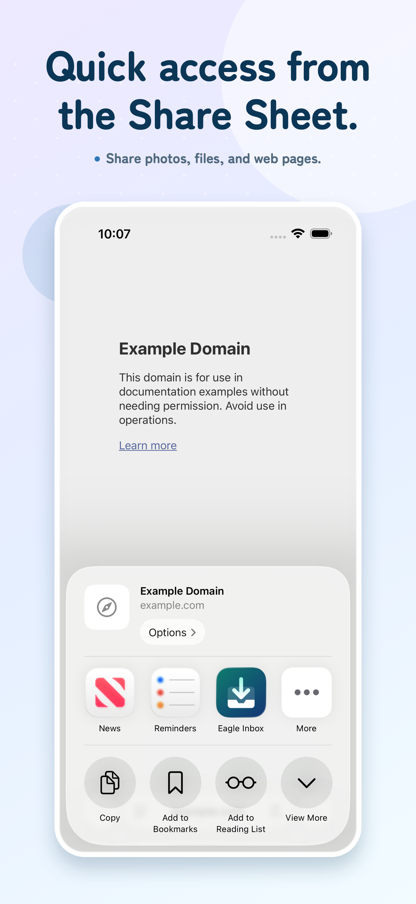
  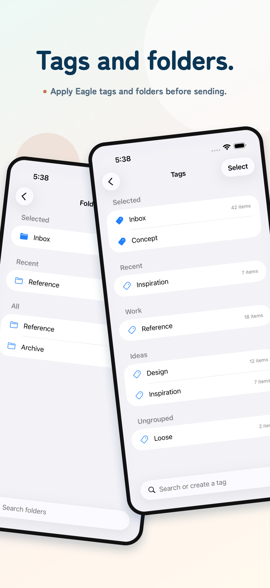
  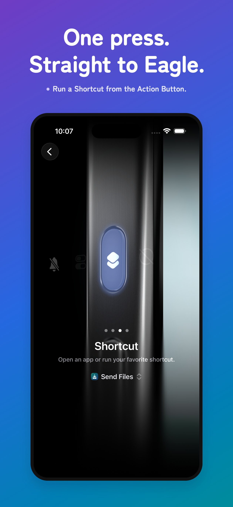

## Get Started

### 1. Connect to Eagle

Open the destination library in Eagle. In Eagle Inbox, tap `Connection Required`, choose or add a connection, select HTTP (the default) or HTTPS, and enter the server’s host or IP address and port (usually `41595` for Eagle). Run `Test Connection`, then save and select the connection. Add the API token from Eagle → Settings → Developer only if required.

| 1. Before setup | 2. Add a connection |
| --- | --- |
| 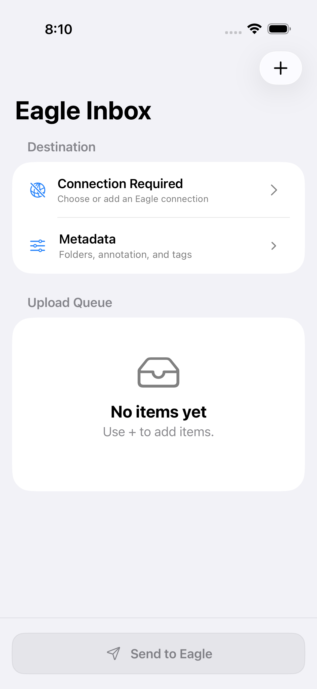 | 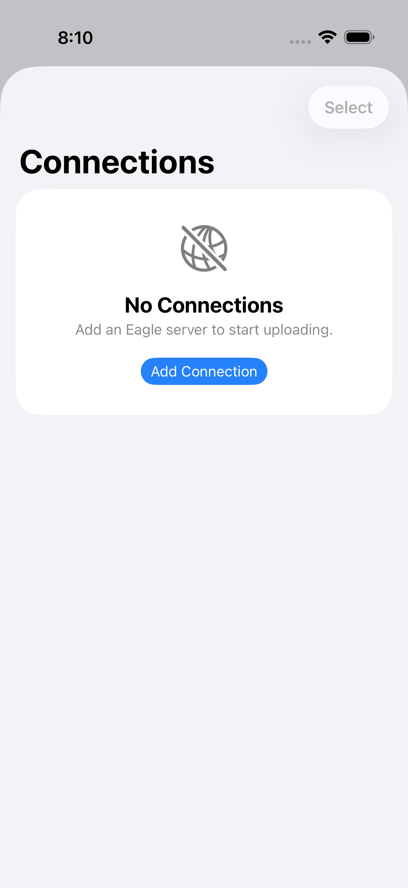 |

| 3. Connection editor | 4. Saved connection |
| --- | --- |
| 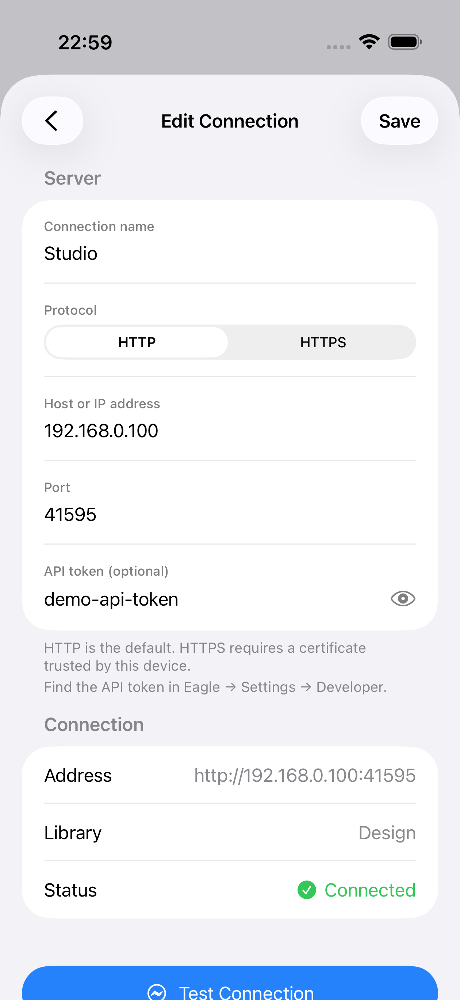 | 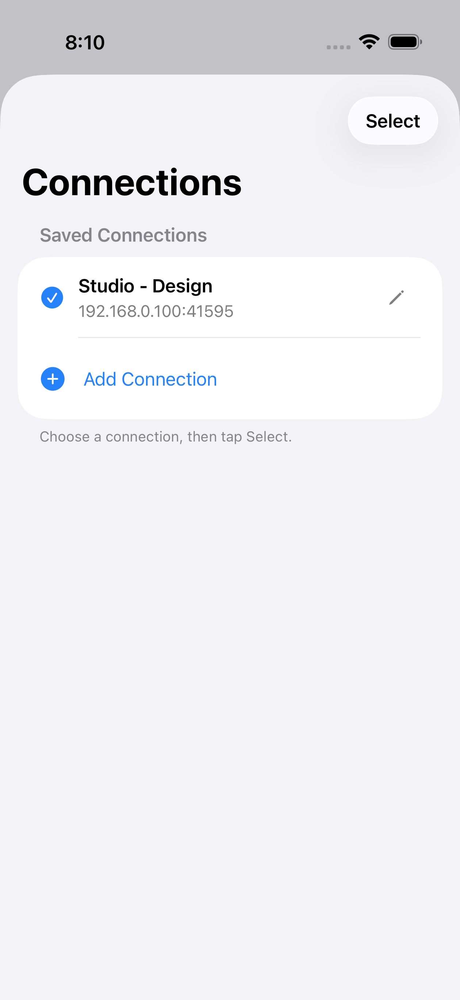 |

The host, library name, and API token shown are examples.

> [!NOTE]
> For a direct connection to the Eagle desktop app, use HTTP. HTTPS is intended for custom endpoints compatible with the subset of Eagle Web API v2 used by Eagle Inbox. The endpoints used by Eagle Inbox are listed in [Eagle Web API v2 compatibility](./Docs/EAGLE_WEB_API_COMPATIBILITY.md).

### 2. Add items

Tap `+` to add photos, files, or a URL. Use Metadata to apply folders, an annotation, and tags to the batch.

| Add items | Set metadata |
| --- | --- |
| 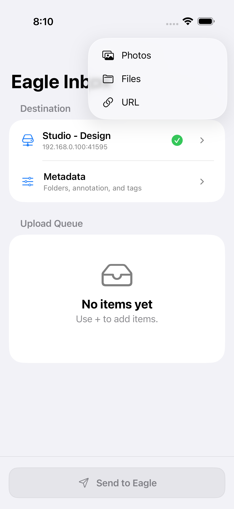 | 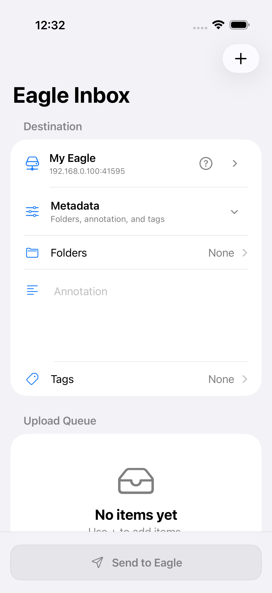 |

Open Folders or Tags from Metadata to reuse recent choices, browse available values, and apply them to the entire batch.

| Choose folders | Choose tags |
| --- | --- |
| 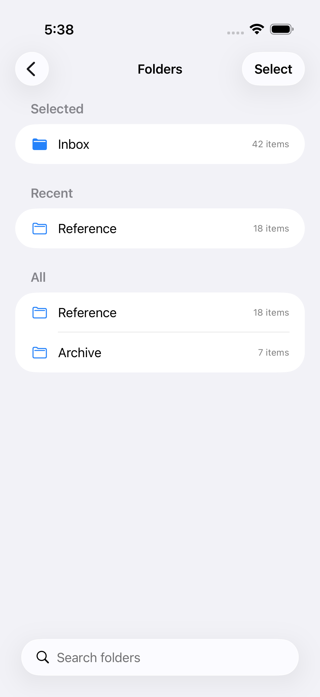 | 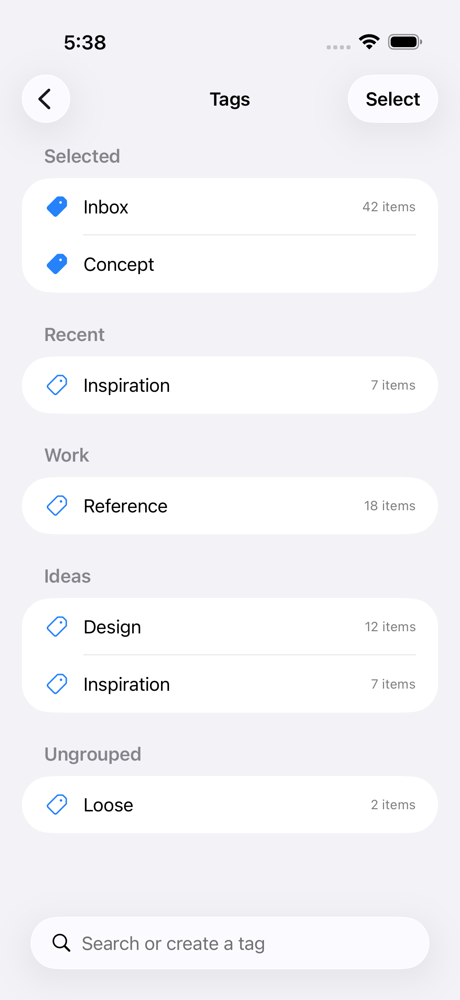 |

### 3. Send or share

Tap `Send to Eagle` when the queue is ready. You can also open Eagle Inbox from the share sheet in another app.

| Ready to send | Share from another app |
| --- | --- |
| 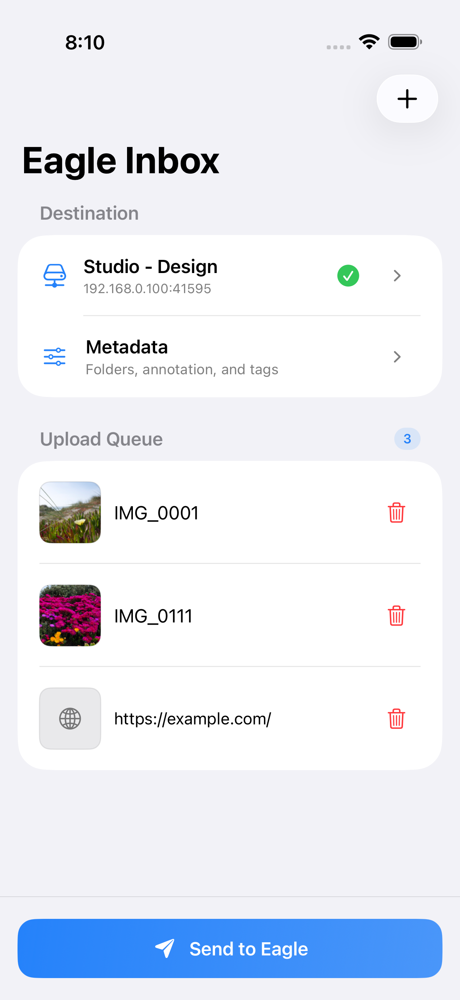 | 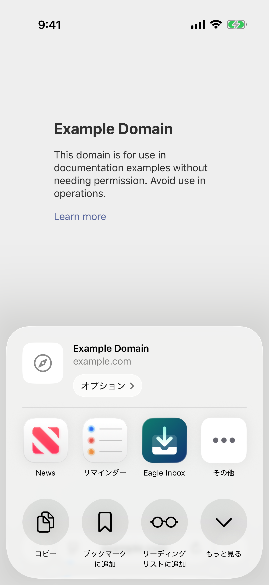 |

Allow local network access when prompted. Notifications are optional and do not affect uploads.

### 4. Use Shortcuts or the Action Button

Eagle Inbox provides five actions in Apple Shortcuts:

- `Send URLs to Eagle` saves HTTP and HTTPS URLs as Eagle bookmarks
- `Send URLs to Eagle with Tags, Annotation` saves URLs with optional tags and an optional annotation
- `Send Files to Eagle` accepts photos, videos, audio, and PDFs
- `Send Files to Eagle with Tags, Annotation` sends supported files with optional tags and an optional annotation
- `Split Text into Tags` turns comma- or newline-separated text into a tag list

All send actions use the connection currently selected in Eagle Inbox and run without opening the app. The selected connection must have been tested and the expected Eagle library must be open.

| Shortcut example | Assign it to the Action Button |
| --- | --- |
| 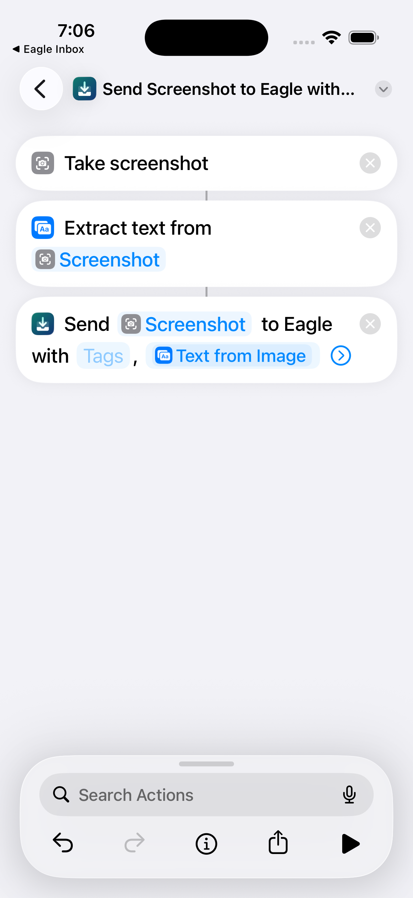 | 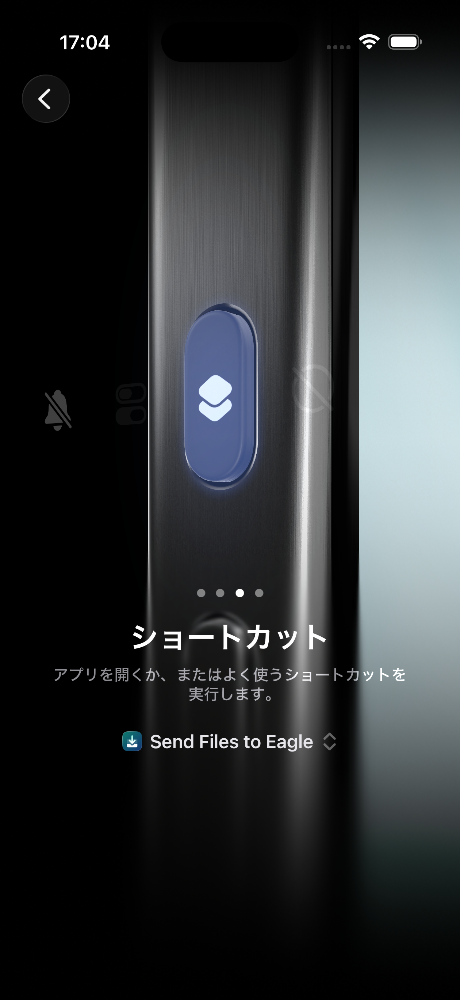 |

## Features

- Send photos, videos, audio, PDFs, and URLs to Eagle
- Connect to Eagle or a compatible endpoint over HTTP or HTTPS
- Add items from the share sheet
- Send items from Apple Shortcuts and Action Button workflows
- Save and switch between multiple connections
- Apply folders, an annotation, and tags to an entire batch
- Preview queued items with thumbnails, cancel uploads, and retry failures
- Verify the destination Eagle library before uploading
- Use the app, share extension, notifications, and Shortcuts in English or Japanese

## Requirements

- Optimized for iPhone with iOS 17 or later
- Available on iPad in iPhone compatibility mode
- Available on Apple Silicon Macs as a Designed for iPhone app
- Eagle 4.0 Build 21 or later

Mac Catalyst and Intel Macs are not supported.

For a direct connection to the Eagle desktop app, connect the Mac or Windows PC running Eagle and the device running Eagle Inbox to the same trusted local network.

## Network and Eagle Web API

Eagle Inbox communicates with the [Eagle Web API v2](https://developer.eagle.cool/web-api) or an API-compatible custom endpoint. Each saved connection can use `http://<host>:<port>/api/v2/...` (the default) or `https://<host>:<port>/api/v2/...`. Eagle normally uses HTTP on port `41595`; custom endpoints can use HTTPS and any configured port. An API token, when configured, is included in the URL query parameters.

Files and metadata are sent directly from Eagle Inbox to the computer running Eagle. They are not relayed through an Eagle Inbox server.

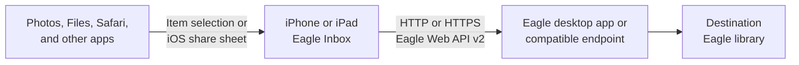

HTTP does not encrypt the API token or uploaded content in transit, so use HTTP connections only on a trusted private network. Do not expose an unencrypted Eagle API port to the internet or use it over public Wi-Fi. HTTPS endpoints must present a certificate trusted by the device. iOS may ask for Local Network permission before the first local connection.

## Library Mismatch

Each connection stores the name of the Eagle library that was open when the connection was tested.

| Mismatch warning | Confirmation before sending |
| --- | --- |
| 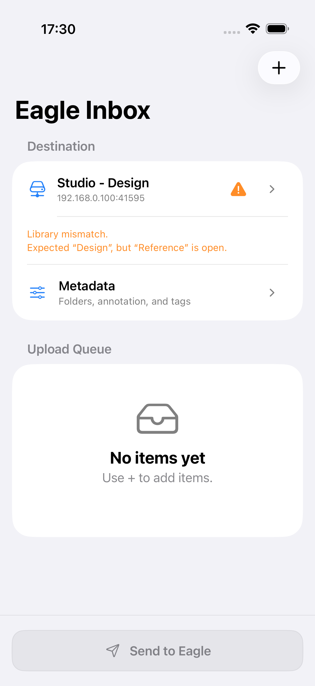 | 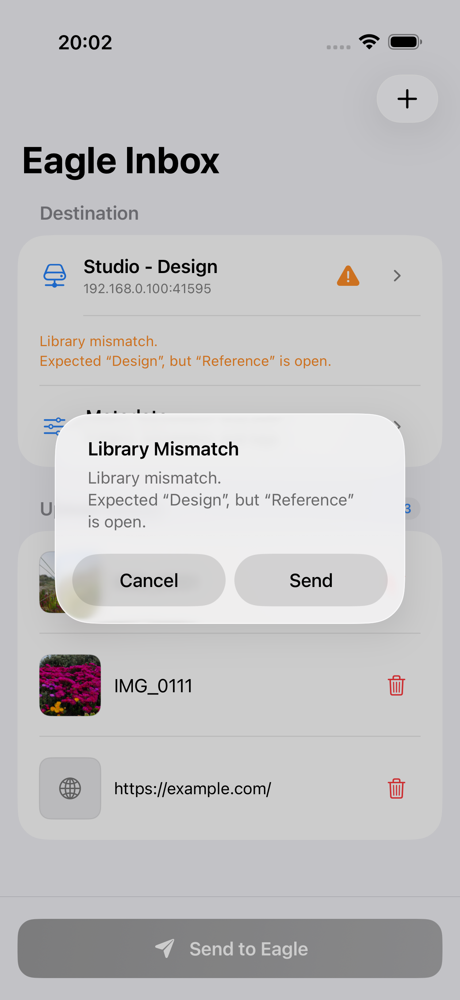 |

- The main screen displays `Library mismatch.` when another library is open.
- During an upload, you can confirm that you want to use the currently open library for that upload only.
- To change the library stored with a connection, run `Test Connection` in the Connection Editor.

## Privacy and Security

API tokens are stored in Keychain. The app includes no third-party advertising, analytics, or tracking SDKs.

The Eagle Web API connection sends the API token as a URL query parameter. HTTP connections do not encrypt it in transit. See [Network and Eagle Web API](#network-and-eagle-web-api) for the communication path and network precautions.

## Developer Documentation

- [Architecture](./Docs/ARCHITECTURE.md)
- [Build, test, and release guide](./Docs/DEVELOPMENT.md)
- [App Store submission draft](./Docs/APP_STORE_SUBMISSION.md)
- [Eagle Web API v2](https://developer.eagle.cool/web-api)
